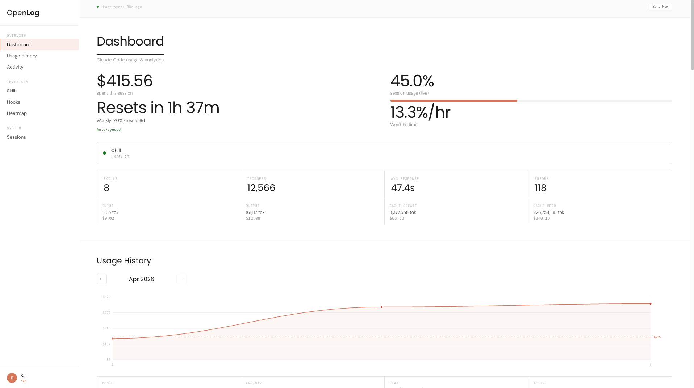
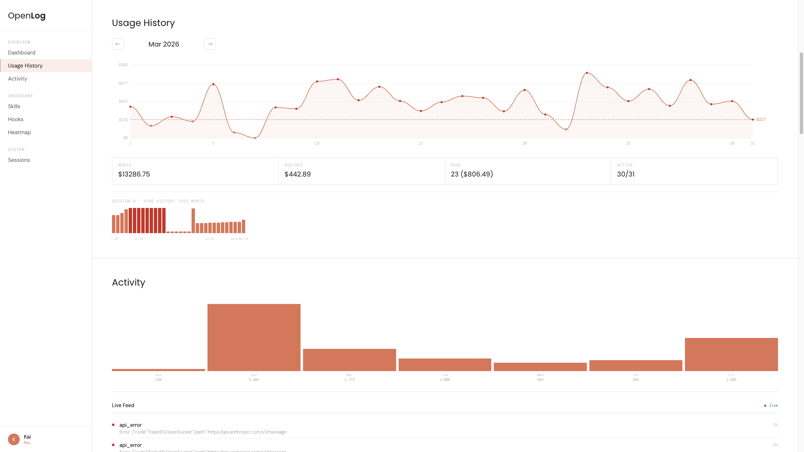
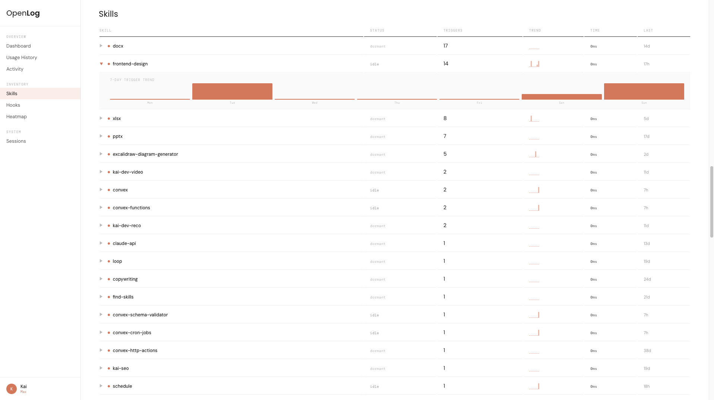
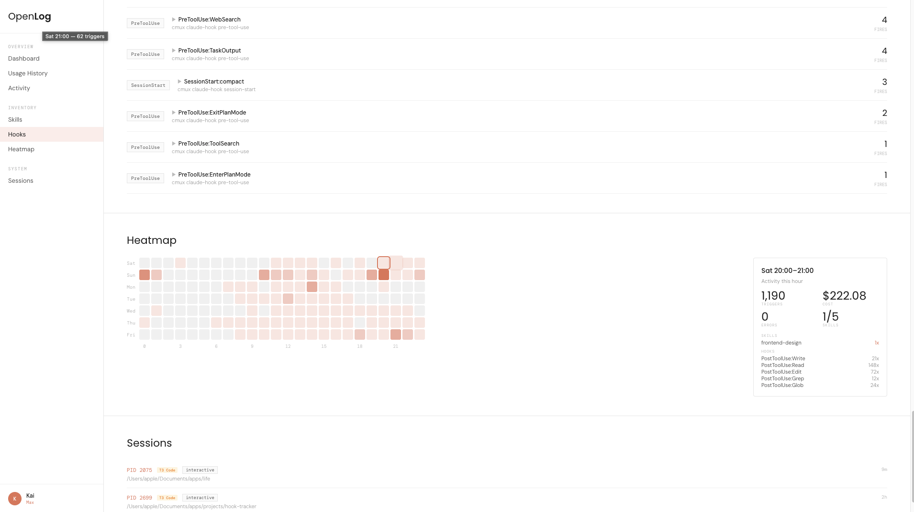
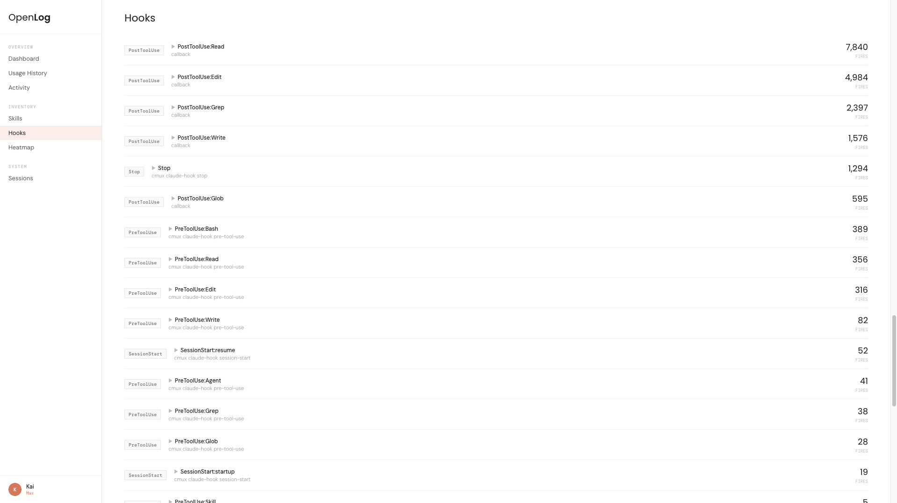
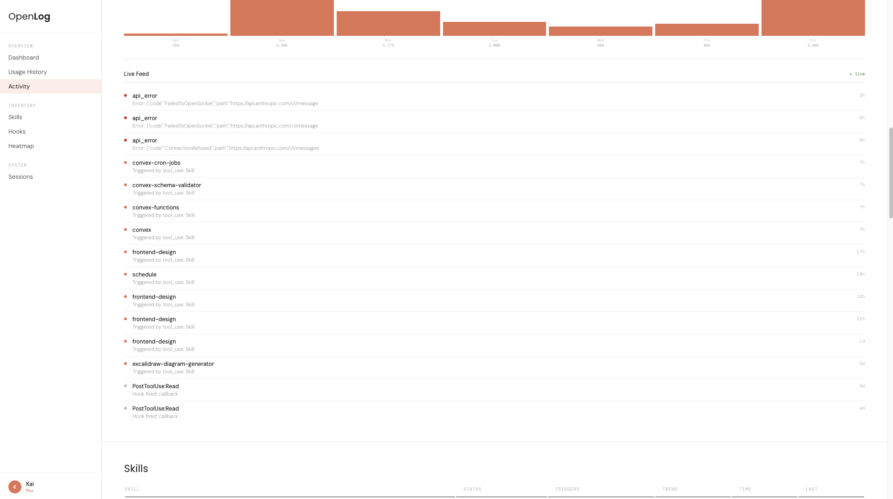

# OpenLog

**Local analytics dashboard for Claude Code.** See your usage, skills, hooks, and sessions — all in one place.



## Why

Claude Code gives you no visibility into your usage. You're flying blind on rate limits, token costs, and which skills actually fire. OpenLog reads your local Claude Code data and shows you everything.

- **Exact usage %** synced from Anthropic (session + weekly)
- **Cost tracking** with token breakdown (input, output, cache)
- **Burn rate forecast** — will you hit the limit?
- **Skills & hooks** — which ones fire, how often, trends
- **Usage history** — daily cost over time with monthly graphs
- **Heatmap** — when are you most active?
- **Sessions** — all running Claude instances with app type

## Install

Requires [Bun](https://bun.sh) and macOS.

```bash
# Clone
git clone https://github.com/kaiwilliams-dev/open-log.git
cd open-log

# Install dependencies
bun install

# Start the server
bun run start
```

Open **http://localhost:7777**

### Always-on (optional)

Run the install script to start OpenLog on login:

```bash
bash install.sh
```

This sets up a LaunchAgent and adds `openlog.local` to your hosts file.

## How it works

OpenLog reads Claude Code's local data from `~/.claude/projects/` — the same JSONL files that store every conversation, tool use, and API response. Nothing leaves your machine.

### Usage sync

For exact usage percentages, OpenLog spawns a lightweight Claude session via `tmux`, captures the rate limit data from the statusline hook, and displays it on the dashboard. Click **Sync Now** to refresh.

**Terminal users:** The statusline hook auto-updates on every Claude response — no manual sync needed.

**IDE users (T3 Code / VS Code):** Click Sync Now on the dashboard. Uses Haiku model (~$0.001 per sync).

### Setup the statusline hook

Add this to your `~/.claude/statusline-command.sh` to enable auto-sync for terminal users:

```bash
# At the end of your statusline-command.sh, add:
five_pct=$(echo "$input" | jq -r '.rate_limits.five_hour.used_percentage // empty' 2>/dev/null)
five_reset=$(echo "$input" | jq -r '.rate_limits.five_hour.resets_at // empty' 2>/dev/null)
week_pct=$(echo "$input" | jq -r '.rate_limits.seven_day.used_percentage // empty' 2>/dev/null)
week_reset=$(echo "$input" | jq -r '.rate_limits.seven_day.resets_at // empty' 2>/dev/null)
if [ -n "$five_pct" ] || [ -n "$week_pct" ]; then
  mkdir -p ~/.openlog
  five_pct_r=$(printf '%.1f' "${five_pct:-0}" 2>/dev/null || echo "${five_pct:-null}")
  week_pct_r=$(printf '%.1f' "${week_pct:-0}" 2>/dev/null || echo "${week_pct:-null}")
  printf '{"ts":%s,"five_hour":{"pct":%s,"resets_at":%s},"seven_day":{"pct":%s,"resets_at":%s}}\n' \
    "$(date +%s)" "${five_pct_r}" "${five_reset:-null}" "${week_pct_r}" "${week_reset:-null}" \
    > ~/.openlog/limits.json
fi
```

## Screenshots

| Dashboard | Usage History | Skills |
|---|---|---|
|  |  |  |

| Heatmap | Hooks | Sessions |
|---|---|---|
|  |  |  |

## Stack

- **Bun** — server runtime
- **Single HTML file** — no build step, no framework
- **tmux** — for reliable usage sync via Claude TUI
- Reads `~/.claude/projects/**/*.jsonl` locally

## Requirements

- macOS (LaunchAgent, tmux)
- [Bun](https://bun.sh) v1.0+
- [tmux](https://github.com/tmux/tmux) (`brew install tmux`)
- Claude Code subscription (Pro/Max)
- `jq` for statusline hook (`brew install jq`)

## License

MIT
